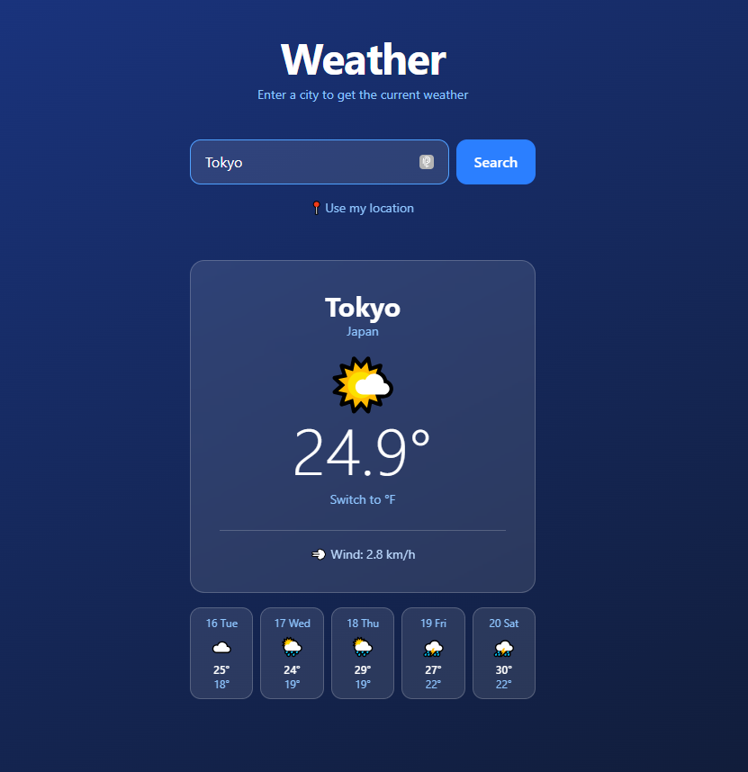

# Weather App

A clean, responsive weather application built with React and Tailwind CSS.

🌐 **Live demo:** https://weather-app-sand-pi-87.vercel.app



## Features

- 🔍 Search weather by city name
- 📍 Detect current location automatically
- 🌡️ Toggle between Celsius and Fahrenheit
- 📅 5-day forecast with weather icons
- 🕐 Recent searches saved locally
- 💀 Skeleton loader while fetching data
- 📱 Fully responsive design

## Tech Stack

- React 19
- Tailwind CSS 3
- Open-Meteo API (no API key required)
- Vite
- Deployed on Vercel

## Technical decisions

- **Custom hook (`useWeather`)** — separates all API and state logic from UI components, keeping them clean and reusable.
- **Open-Meteo** — chosen because it's free, reliable, and requires no API key, making the project easy to clone and run.
- **Tailwind CSS** — utility-first approach speeds up styling while keeping the bundle small.

## Run locally

```bash
git clone https://github.com/LaloCHL/weather-app.git
cd weather-app
npm install
npm run dev
```

## Author

Eduardo Chan — [linkedin.com/in/chaneduardo](https://linkedin.com/in/chaneduardo)